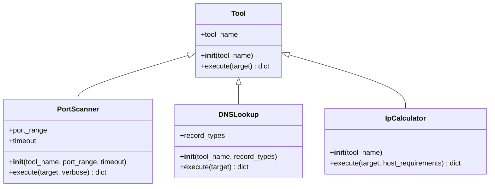

# Manuale tecnico

> Documento rivolto agli sviluppatori che devono comprendere, mantenere o estendere Network Toolkit.

## Architettura generale

Network Toolkit è un’applicazione Python a riga di comando che raccoglie strumenti per l’analisi di rete. La struttura è basata su una classe comune, `Tool`, dalla quale ereditano gli strumenti concreti.

Il programma separa:

* la gestione dell’interazione con l’utente;
* il comportamento comune a tutti gli strumenti;
* la logica specifica di ogni strumento.

Struttura principale:

```text
src/
└── project/
    ├── __init__.py
    ├── __main__.py
    ├── tool.py
    ├── port_scanner.py
    ├── dns_lookup.py
    ├── ip_calculator.py
    └── report_exporter.py
```

### `__init__.py`

Identifica la cartella `project` come package Python.

### `__main__.py`

È il punto di ingresso dell’applicazione quando viene eseguita con:

```bash
PYTHONPATH=src python -m project
```

Si occupa dell’interfaccia a riga di comando:

* mostra il menu;
* raccoglie e valida gli input;
* crea l’oggetto corrispondente allo strumento scelto;
* chiama il metodo `execute(target)`;
* mostra il report finale.

La logica di rete non viene implementata nel file principale, così da mantenere separate l’interfaccia e le operazioni degli strumenti.

### `tool.py`

Contiene la classe base `Tool`.

La classe conserva il nome dello strumento e definisce il metodo comune:

```python
execute(target)
```

Il metodo prepara un report standard con questa struttura:

```python
{
    "tool": nome dello strumento,
    "target": bersaglio dell’operazione,
    "esito": stato dell’esecuzione,
    "risultato": dati prodotti
}
```

Le sottoclassi richiamano questo metodo attraverso `super().execute(target)` e completano il report con i propri risultati.

### `port_scanner.py`

Contiene la classe `PortScanner`, che eredita da `Tool`.

Il costruttore riceve:

* il nome dello strumento;
* l’intervallo di porte da analizzare;
* il timeout delle connessioni.

Il metodo `execute(target)` prova ad aprire una connessione TCP verso ogni porta configurata e distingue:

* porte aperte;
* porte chiuse;
* porte per le quali si verifica un timeout.

L’opzione `verbose` permette di mostrare informazioni durante la scansione.

### `dns_lookup.py`

Contiene la classe `DNSLookup`, che eredita da `Tool`.

Il dominio viene ricevuto attraverso `execute(target)`, mentre i tipi di record da interrogare vengono passati al costruttore.

I record attualmente supportati sono:

* `A`;
* `AAAA`;
* `MX`;
* `TXT`.

Il metodo esegue una query per ogni tipo richiesto e costruisce due dizionari:

```python
record_status = {
    "A": "Risolto con successo",
    "MX": "Record non presente"
}
```

```python
dns_results = {
    "A": ["192.0.2.10"],
    "MX": []
}
```

Alla fine dell’esecuzione, questi dizionari vengono inseriti rispettivamente nelle chiavi `esito` e `risultato` del report comune.

### `ip_calculator.py`

Contiene la classe `IpCalculator`, che eredita da `Tool`.

A differenza di `PortScanner` e `DNSLookup`, il costruttore non riceve alcuna configurazione
oltre al `tool_name`: sia la rete di partenza sia il numero di host richiesti cambiano a ogni
calcolo, quindi vengono passati entrambi a `execute(target, host_requirements)`.

L’algoritmo implementa la tecnica VLSM (Variable Length Subnet Masking):

1. gli host richiesti vengono ordinati in ordine decrescente, per assegnare prima le sottoreti
   più grandi ed evitare di frammentare lo spazio di indirizzi;
2. per ciascun valore si calcola il numero minimo di bit host necessari con
   `math.ceil(math.log2(host + 2))` (il `+2` tiene conto degli indirizzi di rete e broadcast
   riservati);
3. un "cursore" (`cursor`), inizializzato all’indirizzo di rete, tiene traccia del primo
   indirizzo libero e avanza dopo ogni sottorete allocata (`subnet.broadcast_address + 1`).

La gestione degli indirizzi si appoggia al modulo standard `ipaddress`, che fornisce sia il
parsing/la validazione della notazione CIDR sia le operazioni su reti e sottoreti.

### `report_exporter.py`

Contiene la funzione `export_report(report, file_path)`, usata da `__main__.py` per salvare su
file un report già prodotto da uno strumento.

La funzione serializza il report in JSON con `json.dump` (codifica UTF-8, indentazione a 4
spazi) e intercetta separatamente le eccezioni più comuni di scrittura su file
(`PermissionError`, `FileNotFoundError`, `IsADirectoryError`, `TypeError` per dati non
serializzabili, `OSError` per altri errori del filesystem), stampando un messaggio specifico per
ciascuna invece di un errore generico.

L’aggiunta automatica dell’estensione `.json` quando l’utente non la specifica è gestita in
`__main__.py`, non in questa funzione.

## Flusso di esecuzione

Il flusso generale è il seguente:

```text
Utente
  |
  v
__main__.py
  |
  | crea lo strumento scelto
  v
Tool o relativa sottoclasse
  |
  | execute(target)
  v
Report standard
  |
  v
Stampa nel terminale
```

Esempio per il DNS Lookup:

```text
L’utente seleziona DNS Lookup
            |
            v
Inserisce dominio e tipi di record
            |
            v
__main__.py crea DNSLookup
            |
            v
DNSLookup.execute(dominio)
            |
            v
Tool.execute(dominio) crea il report base
            |
            v
DNSLookup interroga i record richiesti
            |
            v
Il report viene completato e restituito
```

## La gerarchia di classi

La gerarchia è composta dalla classe base `Tool` e dalle sottoclassi concrete.



Il metodo polimorfico è:

```python
execute(target)
```

Il resto del programma può richiamare questo metodo senza dover conoscere i dettagli interni della sottoclasse.

Concettualmente:

```python
tool.execute(target)
```

può avviare un DNS Lookup oppure una scansione delle porte, a seconda dell’oggetto contenuto in `tool`.

## Ruolo di `super()`

Le sottoclassi utilizzano:

```python
report = super().execute(target)
```

per richiamare il metodo della classe base e ottenere la struttura comune del report.

Questo evita di duplicare in ogni strumento la creazione delle chiavi:

* `tool`;
* `target`;
* `esito`;
* `risultato`.

La sottoclasse deve occuparsi solamente dell’operazione specifica e dell’aggiornamento del report.

## Gestione degli errori nel DNSLookup

`DNSLookup` utilizza eccezioni specifiche fornite da `dnspython`.

### `NXDOMAIN`

Indica che il dominio non esiste.

### `NoAnswer`

Indica che il dominio esiste ma non contiene il tipo di record richiesto.

### `Timeout`

Indica che la risoluzione DNS non è terminata entro il tempo previsto.

### `NoNameservers`

Indica che nessun nameserver disponibile è riuscito a completare la query.

## Gestione degli errori nel PortScanner

Il PortScanner gestisce le situazioni prodotte durante i tentativi di connessione TCP:

* connessione riuscita: porta aperta;
* connessione rifiutata: porta chiusa;
* timeout: nessuna risposta entro il tempo configurato.

Il risultato finale separa le porte nelle rispettive categorie.

## Gestione degli errori in IpCalculator

Il metodo `execute` usa un blocco `try`/`except ValueError`/`else`:

* `try` esegue il calcolo delle sottoreti;
* `except ValueError` intercetta sia un `target` non valido (sollevato da
  `ipaddress.ip_network`) sia un numero di host ≤ 0 (controllo esplicito nel ciclo);
* `else` imposta l’esito di successo solo se nessuna eccezione è stata sollevata.

Il caso di spazio di indirizzi esaurito (la sottorete calcolata non rientra più nella rete di
partenza) non è un’eccezione ma un ritorno anticipato con esito di fallimento, perché è una
condizione prevista del dominio del problema e non un errore di programmazione.

**Comportamento noto**: poiché il controllo `host <= 0` si trova nello stesso blocco `try` che
gestisce la validità dell’indirizzo di rete, il messaggio finale in `risultato` inizia sempre con
il prefisso `"L'indirizzo di rete inserito non è valido: "`, anche quando il problema riguarda
gli host. Questo comportamento è documentato e verificato esplicitamente nei test automatici
(`tests/test_ip_calculator.py`); si veda anche `docs/scelte.md`.

## Come aggiungere una nuova sottoclasse

Per aggiungere un nuovo strumento:

1. creare un nuovo file dentro `src/project/`;
2. importare la classe base con un import relativo;
3. creare una classe che eredita da `Tool`;
4. richiamare `super().__init__(tool_name)` nel costruttore;
5. ridefinire il metodo `execute(target)`;
6. ottenere il report base tramite `super().execute(target)`;
7. eseguire la logica specifica;
8. valorizzare `esito` e `risultato`;
9. restituire il report;
10. importare e registrare il nuovo strumento nel menu di `__main__.py`.

Struttura minima:

```python
from .tool import Tool


class NuovoTool(Tool):
    def __init__(self, tool_name, configurazione):
        super().__init__(tool_name)
        self.configurazione = configurazione

    def execute(self, target: str) -> dict:
        report = super().execute(target)

        # Logica specifica dello strumento

        report["esito"] = "Operazione completata"
        report["risultato"] = risultato

        return report
```

La configurazione stabile dello strumento dovrebbe essere passata al costruttore, mentre il bersaglio dell’operazione deve essere passato a `execute(target)`.

## Dipendenze esterne

### Python

Il progetto richiede Python 3.11 o superiore.

### dnspython

La libreria `dnspython` viene utilizzata da `DNSLookup` per:

* eseguire query DNS;
* interrogare tipi di record differenti;
* ricevere risposte strutturate;
* gestire eccezioni specifiche.

### socket

Il modulo `socket` della libreria standard viene utilizzato dal PortScanner per effettuare connessioni TCP.

Non richiede installazioni aggiuntive.

### pprint

Il modulo `pprint` della libreria standard viene utilizzato nell’interfaccia per mostrare i report in modo leggibile.

### ipaddress e math

I moduli standard `ipaddress` e `math` vengono utilizzati da `IpCalculator` rispettivamente per
la rappresentazione/validazione di reti e indirizzi IPv4 e per il calcolo dei bit host necessari
in ciascuna sottorete (VLSM).

### json

Il modulo standard `json` viene utilizzato da `report_exporter.py` per serializzare i report su
file.

## Installazione dell’ambiente di sviluppo

Dalla radice della repository:

```bash
python -m venv .venv
source .venv/bin/activate
pip install -r requirements.txt
```

Per eseguire il progetto:

```bash
PYTHONPATH=src python -m project
```

## Test e verifiche

Per eseguire i test automatici:

```bash
pytest
```

## Estensioni future

Possibili estensioni compatibili con l’architettura:

* supporto a record DNS `NS`, `CNAME`, `SOA` e `PTR`;
* test automatici con mock delle query DNS e delle connessioni TCP;
* separazione del menu in un modulo `cli.py`;
* configurazione del resolver e del timeout DNS;
* suddivisione di reti IPv6 in `IpCalculator`.